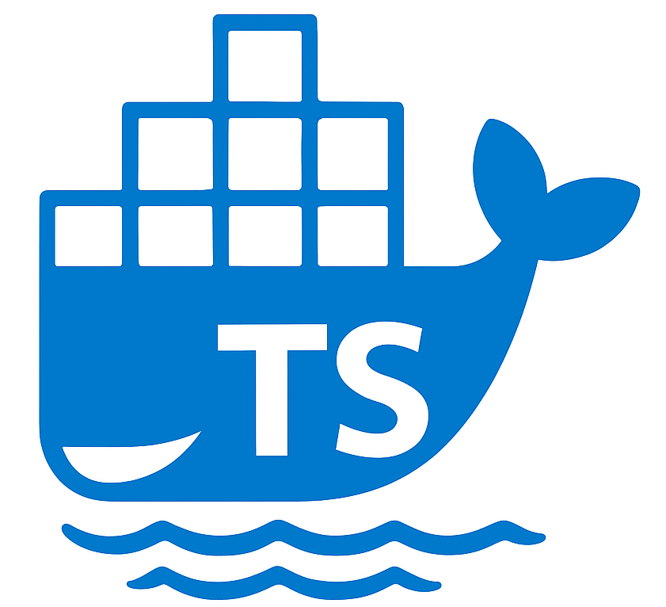

# Docker-TS, a TypeScript SDK for Docker API

Docker-TS is designed with some key principes:

## Keep it Simple Stupid 
Docker-TS uses a strict minimum of dependencies. Typically, no high-level HTTP client library
is used, so that we can easily connect to Unix Domain Socket or SSH remote engine as plain TCP,
which is a requirement to implement the `ContainerAttach` API.

## Reduce maintenance effort
API model is generated from the official OpenAPI specification. If something is incorrect, we
prefer to contribute to this specification so we later don't have to worry about it.
We also rely on custom openapi-generator template to enforce minimalist code being generated
for the purpose of a SDK.

